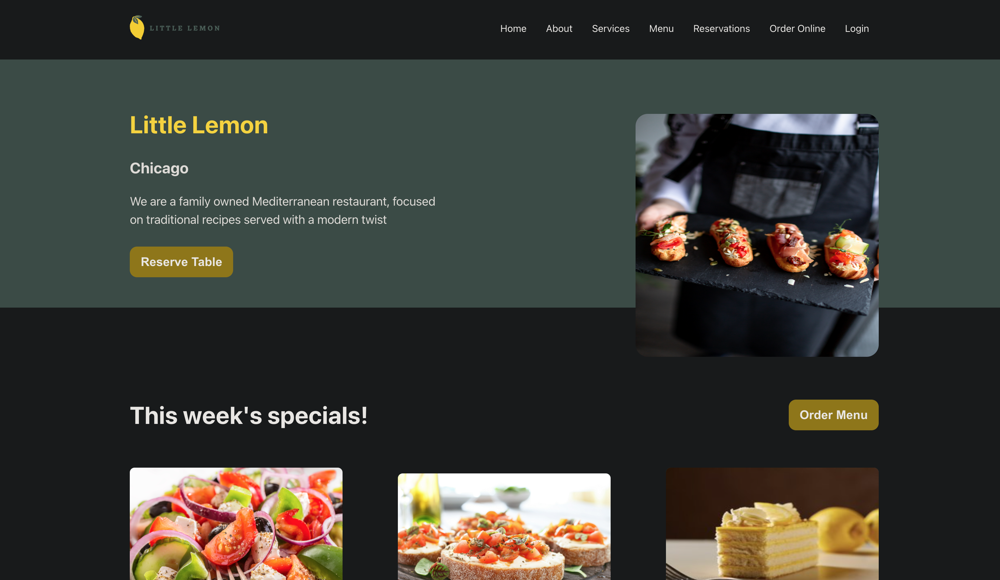

# 🍋 Meta Front-End Developer Capstone Project



> A responsive **restaurant reservation system** built with React as the capstone project for the Meta Front-End Developer specialization.  
> The project demonstrates routing, state management, form validation, and component-based design following industry best practices.

---

## 🚀 Live Demo
🔗 [View on GitHub Pages](https://mo7amedshaban.github.io/meta-frontend-project/)  


---

## 🛠️ Tech Stack
- **React 18** (with React Router v6)
- **CSS & modern-normalize**
- **FontAwesome** for icons
- **Jest + React Testing Library** for testing
- **GitHub Pages / Vercel** for deployment

---

## ✨ Features
- 🏠 Home page with hero section and highlights  
- 📖 About & Menu pages (under construction)  
- 📅 Booking form with validation  
- ✅ Confirmation page for successful reservations  
- 🔗 Responsive navigation layout  
- ❌ 404 handling for invalid routes  

---

## ⚙️ Installation & Setup

Clone the repository:
```bash
git clone https://github.com/mo7amedshaban/meta-frontend-project.git
cd meta-frontend-project
npm start
npm run build

